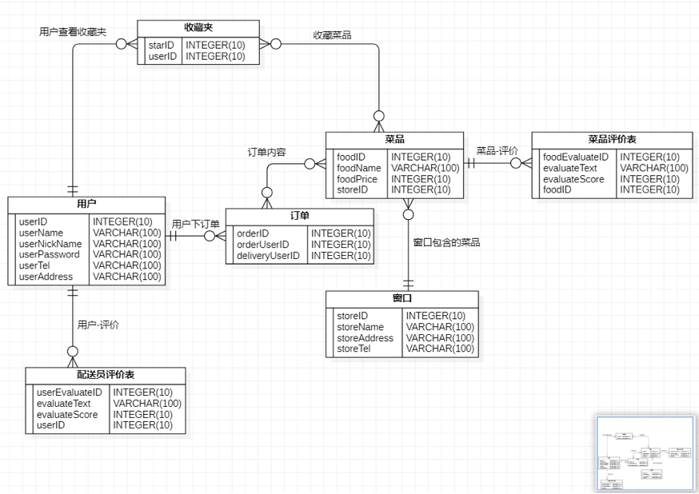

# TakeawayDelivery

## **一．需求分析**

**1.**       **需求描述**
本次数据库实验主要完成的内容为高共享食堂外卖配送系统。

高共享食堂配送系统主要包含用户点餐以及创建订单、食堂提供菜品、配送员创建配送表、用户增加或者删除收藏夹内容以及用户对食堂配送评价和对菜品的评价。

主要需要实现用户对食堂外卖的下单以及配送。最大的亮点就是所有用户都可以作为配送员的身份参与交互，例如：张三今天顺路到食堂给李四带了一份饭，明天李四正好方便就给王五带了一份饭，都是送到具体的宿舍楼或者指定地点。这就需要实现对配送表和相关订单以及用户信息的维护和增删操作。

**2.**       **数据流图**

**3.**       **数据元素表**


## 对象

### **1.用户**

| **序号** | **名称**      | **前端参数名称** | **数据类型** | **大小** | **是否必填** | **是否主键** | **功能** |
| :------- | :------------ | :------------------- | :----------- | :------- | :----------- | :----------- | :------- |
| 1        | user_id       | userID               | Int          | 10       | 是           | 是           | ID       |
| 2        | user_name     | userName             | Varchar      | 100      | 是           | 否           | 用户名   |
| 3        | user_nickname | userNickname         | Varchar      | 100      | 是           | 否           | 用户昵称 |
| 4        | user_password | userPassword         | Varchar      | 100      | 是           | 否           | 用户密码 |
| 5        | user_tel      | userTel              | Varchar      | 100      | 是           | 否           | 用户电话 |
| 6        | user_address  | userAddress          | Varchar      | 100      | 是           | 否           | 用户地址 |

### **2.菜品**

| **序号** | **名称**   | **前端参数名称** | **数据类型** | **大小** | **是否必填** | **是否主键** | **功能** |
| :------- | :--------- | :--------------- | :----------- | :------- | :----------- | :----------- | :------- |
| 1        | food_id    | foodID           | Int          | 10       | 是           | 是           | 菜品ID   |
| 2        | food_name  | foodName         | Varchar      | 100      | 是           | 否           | 菜品名称 |
| 3        | food_price | foodPrice        | Int          | 10       | 是           | 否           | 菜品价格 |
| 4        | food_url   | foodUrl          | Varchar      | 200      | 否           | 否           | 菜品图片 |
 | 5        | store_id   | storeID          | Int          | 10       | 是           | 否           | 窗口ID   |

### **3.窗口**

| **序号** | **名称**      | **前端参数名称** | **数据类型** | **大小** | **是否必填** | **是否主键** | **功能** |
| :------- | :------------ | :--------------- | :----------- | :------- | :----------- | :----------- | :------- |
| 1        | store_id      | storeID          | Int          | 10       | 是           | 是           | 窗口ID   |
| 2        | store_name    | storeName        | Varchar      | 100      | 是           | 否           | 窗口名称 |
| 3        | store_address | storeAddress     | Varchar      | 100      | 是           | 否           | 窗口地址 |
| 4        | store_tel     | storeTel         | Varchar      | 100      | 是           | 否           | 窗口电话 |

### **4.订单表**

| **序号** | **名称**         | **前端参数名称** | **数据类型** | **大小** | **是否必填** | **是否主键** | **功能**     |
 | :------- | :--------------- | :--------------- | :----------- | :------- | :----------- | :----------- | :----------- |
 | 1        | order_id         | orderID          | Int          | 10       | 是           | 是           | 订单ID       |
 | 2        | order_completed  | orderCompleted   | Boolean      | 1        | 是           | 否           | 订单是否完成 |
 | 3        | order_user_id    | orderUserID      | Int          | 10       | 是           | 否           | 下单用户ID   |
 | 4        | delivery_user_id | deliveryUserID   | Int          | 10       | 否           | 否           | 配送员ID     |

### **5.收藏夹表**

| **序号** | **名称** | **前端参数名称** | **数据类型** | **大小** | **是否必填** | **是否主键** | **功能** |
| :------- | :------- | :--------------- | :----------- | :------- | :----------- | :----------- | :------- |
| 1        | star_id  | starID           | Int          | 10       | 是           | 是           | 收藏夹ID |
| 2        | user_id  | userID           | Int          | 10       | 是           | 否           | 用户ID   |

### **6.菜品评价表**

| **序号** | **名称**            | **前端参数名称** | **数据类型** | **大小** | **是否必填** | **是否主键** | **功能** |
| :------- | :------------------ | :------------------- | :----------- | :------- | :----------- | :----------- | :------- |
| 1        | food_evaluate_id    | foodEvaluateID       | Int          | 10       | 是           | 是           | 评价号   |
| 2        | food_evaluate_text  | foodEvaluateText     | Varchar      | 100      | 是           | 否           | 评价内容 |
| 3        | food_evaluate_score | foodEvaluateScore    | Int          | 10       | 是           | 否           | 评分     |
| 4        | food_id             | foodID               | Int          | 10       | 是           | 否           | 菜品的ID |

### 7.配送员评价表

| **序号** | **名称**            | **前端参数名称** | **数据类型** | **大小** | **是否必填** | **是否主键** | **功能**                   |
| :------- | :------------------ | :------------------- | :----------- | :------- | :----------- | :----------- | :------------------------- |
| 1        | user_evaluate_id    | userEvaluateID       | Int          | 10       | 是           | 是           | 评价号                     |
| 2        | user_evaluate_text  | userEvaluateText     | Varchar      | 100      | 是           | 否           | 评价内容                   |
| 3        | user_evaluate_score | userEvaluateScore    | Int          | 10       | 是           | 否           | 评分                       |
| 4        | user_id             | userID               | Int          | 10       | 是           | 是           | 用户ID（发表评价对象的ID） |

### 8.订单-菜品关系

| **序号** | **名称** | **前端参数名称** | **数据类型** | **大小** | **是否必填** | **是否主键** | **功能** |
| :------- | :------- | :------------------- | :----------- | :------- | :----------- | :----------- | :------- |
| 1        | order_id | orderID              | Int          | 10       | 是           | 否           | 订单ID   |
| 2        | food_id  | foodID               | Int          | 10       | 是           | 否           | 菜品ID   |
| 3        | food_num | foodNum              | Int          | 10       | 是           | 否           | 菜品个数 |

### **9.收藏夹-菜品关系**

| **序号** | **名称** | **前端参数名称** | **数据类型** | **大小** | **是否必填** | **是否主键** | **功能** |
| :------- | :------- | :------------------- | :----------- | :------- | :----------- | :----------- | :------- |
| 1        | star_id  | starID               | Int          | 10       | 是           | 否           | 收藏夹ID |
| 2        | food_id  | foodID               | Int          | 10       | 是           | 否           | 菜品ID   |

## ER图



## **数据库逻辑模式设计**

**1.**       **数据库关系模式**

**注：由** **E-R** **图得到的关系模式**

**USER(U#, UN, UNN, UP, UT, UA)**

**FOOD(F#, FN, FP, S#)**

**STORE(S#, SN, SA, ST)**

**ORDER(O#, U1#, U2#)**

**STAR(SI#, U#)**

**FOODE(FE#, FET, FES, F#)**

**USERE(UE#, UET, UES, U#)**

**OF(O#, F#, FN)**

**SF(SI#, F#)**

 

**属性之间的约束关系：**

**U# -> UN, UNN, UP, UT, UA**

**F# -> FN, FP, S#**

**S# -> SN, SA, ST**

**O# -> U1#, U2#**

**SI# -> U#**

**FE# -> FET, FES, F#**

**UE# -> UET, UES, U#**

**2.**       **关系模式范式等级的判定与规范化 注：要规范到** **3NF**

**关系模式范式等级为** **4NF**

 

**3.**       **数据库设计优化**


# 接口表

```python
path('api/login/', myapp.views.login),
path('api/register/', myapp.views.register),
path('api/getInformation/', myapp.views.getInformation),
path('api/changeInformation/', myapp.views.changeInformation),
path('api/changePassword/', myapp.views.changePassword),
path('api/getStoreInformation/', myapp.views.getStoreInformation),
path('api/deleteUser/', myapp.views.deleteUser),
path('api/getEvaluateFood/', myapp.views.getEvaluateFood),
path('api/getEvaluateUser/', myapp.views.getEvaluateUser),
```

## 页面：

1. 登录

   `url:api/login/`

   参数：

   * `userName`
   * `userPassword`

   返回值：

   * `userID`

     * `success`

     * `message`

       

2. 注册

   `url:api/register/`

   参数：

   * `userName`
   * `userPassword`
   * `userNickname`
   * `userTel`
   * `userAddress`

   返回值：

   * `userID`
     * `success`

     * `message`

3. 主页面-个人信息

   * 个人信息查询

     `url:api/getInformation/`

     参数：

     * `userID`

     返回值：

     * `userName`
     * `userNickName`
     * `userAddress`
     * `userTel`
     * `userOrder(list)`
     * `userLikes(list)`

   * 我的当前订单

     `url:api/getInformation/`

     参数：

     * `userID`

     返回值：

     * `userName`
     * `userNickName`
     * `userAddress`
     * `userTel`
     * `userOrder(list)`
     * `userLikes(list)`

   * 我的历史订单

     `url:api/getInformation/`

     参数：

     * `userID`

     返回值：

     * `userName`
     * `userNickName`
     * `userAddress`
     * `userTel`
     * `userOrder(list)`
     * `userLikes(list)`

   * 个人收藏夹

     `url:api/getInformation/`

     参数：

     * `userID`

     返回值：

     * `userName`
     * `userNickName`
     * `userAddress`
     * `userTel`
     * `userOrder(list)`
     * `userLikes(list)`

   * 修改信息

     `url:api/changeInformation/`

     参数：

     * `userID`
     * `userNickName`
     * `userTel`
     * `userAddress`
     * `userPassword`

     返回值：

     * `userName`
     * `userNickName`
     * `userAddress`
     * `userTel`
     * `userOrder(list)`
     * `userLikes(list)`

   * 注销用户

     `url:api/logout?/`//这里不确定后端用的是哪个函数

     参数：

     * `userID`

     返回值：

     * `success`
     * `message`

   * 登出用户

     `url:api/logout?/`//这里不确定后端用的是哪个函数

     参数：

     * `userID`

     返回值：

     * `success`
     * `message`

4. 主页面-商铺

   * 学一到五食堂

     `url:api/getShopinfomation`

     参数：

     * `null`//这里直接返回后端数据库中所有食堂信息

     返回值：

     * ` shopList(list)`

5. 主页面-评价

   * 菜

     `url:api/getComments`

     参数：

     * `null`//这里直接返回后端数据库中所有食堂信息

     返回值：

     * ` foodCommentsList(list)`

   * 快递员

     * `url:api/getComments`

       参数：

       * `null`//这里直接返回后端数据库中所有食堂信息

       返回值：

       * ` posterCommentsList(list)`

   * 我发表的评价

     `url:api/getMyComments`

     参数：

     * `userID`

     返回值：

     * ` myCommentsList(list)`

6. 主页面-我接的单

   * 我当前接的单

     `url:api/getMyorderandcomments`

     参数：

     * `userID`

     返回值：

     * ` myCommentsListNow(list)`//数据库查询中查找当前状态为未完成的

   * 我历史接的单

     `url:api/getMyorderandcomments`

     参数：

     * `userID`

     返回值：

     * ` myOrderListHistory(list)`//数据库查询中查找当前状态为已完成的

   * 对我的评价

     `url:api/getMyorderandcomments`

     参数：

     * `userID`

     返回值：

     * ` myCommentsListNow(list)`
